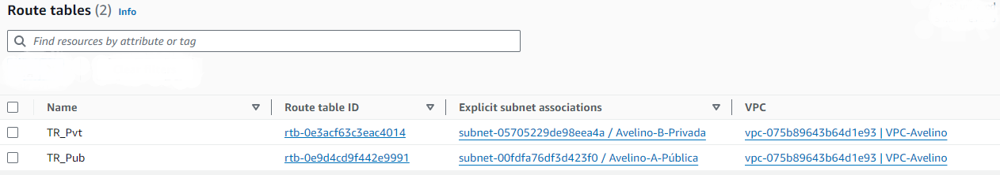

<h1>
    
    Projeto: Configuração de Arquitetura AWS com Bastion Host e Gateway NAT
</h1>

## Objetivo
Neste projeto, iremos configurar um ambiente na AWS utilizando um Bastion Host para acessar uma instância privada sem acesso à internet, fazendo com que essa instância saia para a internet por meio de um NAT Gateway.

## Percurso

<table>
  <thead>
    <tr align="left">
      <th>Nº</th>
      <th>Item</th>
    </tr>
  </thead>
  <tbody align="left">
    <tr>
      <td>01</td>
      <td>Arquitetura</td>
    </tr>
    <tr>
      <td>02</td>
      <td>Criação da VPC</td>
    </tr>
    <tr>
      <td>03</td>
      <td>Criação das Sub-redes</td>  
    </tr>
    <tr>
      <td>04</td>
      <td>Tabelas de Rotas</td>
    </tr>
       <tr>
      <td>05</td>
      <td>Criação do Gateway de Internet</td>
    </tr>
       <tr>
      <td>06</td>
      <td>Criação de Instâncias - Amazon EC2</td>
    </tr>
       <tr>
      <td>07</td>
      <td>Preparando a instância pública para conectar na instância privada</td>
    </tr>
       <tr>
      <td>08</td>
      <td>Conectando à instância privada por meio da instância pública [SSH]</td>
    </tr>
       <tr>
      <td>09</td>
      <td>Configuração do Gateway NAT</td>
    </tr>
       <tr>
      <td>10</td>
      <td>Criando o Gateway NAT</td>
    </tr>
    <tr>
      <td>11</td>
      <td>Conclusão</td>
    </tr>
    <tr>
      <td>12</td>
      <td>Referências</td>
    </tr>
      <tr>
      <td>13</td>
      <td>Contato</td>
    </tr>
  </tbody>
</table>

## 1. Arquitetura

A arquitetura desse projeto é composta pelos seguintes componentes:

| Componente  | Descrição |
| ------------- | ------------- |
| VPC (Virtual Private Cloud)  | **VPC-Avelino** - Rede virtual isolada da AWS onde podem ser lançados recursos, como instâncias EC2, com controle total sobre a configuração de rede, incluindo endereços IP, sub-redes, tabelas de rotas e gateways.  |
| Sub-rede Privada  | **Avelino-B-Privada** - Hospeda a instância EC2-Privada-BD, que não tem acesso direto à internet. A comunicação com esta instância será feita através do Bastion Host na sub-rede pública.   |
| Sub-rede Pública  | **Avelino-A-Pública** - Hospeda o Bastion Host, que tem acesso à internet e permite conexões SSH externas. Ela também aloja o NAT Gateway, que vai permitir que instâncias em sub-rede privadas acessem a internet.  |
| Instância EC2-1 | **Bastion Host** - Instância Pública. É o servidor seguro que atua como ponto de entrada para administradores acessarem uma rede privada a partir da Internet. Ele concentra e controla o acesso, melhorando a segurança ao isolar servidores internos de ataques diretos. |
| Instância EC2-2 | **EC2-Privada-BD** - Servidor dentro da sub-rede privada que não possui acesso direto à Internet.  |
| Tabela de Rotas Pública | **TR_Pub** - Criada automaticamente após a criação da VPC-Avelino. Essa tabela definirá a rota para a sub-rede pública, incluindo uma rota para o Internet Gateway, permitindo que as instâncias na sub-rede pública acessem a Internet. |
| Tabela de Rotas Privada |  **TR_Pvt** - Define as rotas para a sub-rede privada, incluindo uma rota para o Gateway NAT, permitindo que as instâncias na sub-rede privada acessem a Internet através do NAT. |
| Internet Gateway | **Igtw-Avelino** - Componente que conecta a VPC à Internet, permitindo a comunicação das instâncias na sub-rede pública com a Internet. |
| Gateway NAT  | **Gtw-Nat-Avelino** - Permite que a instância privada se comunique com a Internet sem ser exposta diretamente. |

## 2. Criação da VPC

- **Nome:** VPC-Avelino
- **Bloco IPv4:** 10.0.0.0/16
- **Região:** US West - Oregon (us-west-2)
- **Tenancy:** Default

## 3. Criação das Sub-redes

- **Sub-rede Pública:**
  - **Nome:** Avelino-A-Pública
  - **VPC:** VPC-Avelino
  - **Bloco IPv4:** 10.0.1.0/24
  - **Zona de Disponibilidade:** us-west-2a
  - **IPv4 Público:** Habilitado (Marcar a opção <i>Enable auto-assign public IPv4 address</i> em <i>Edit Subnet Settings</i>)

- **Sub-rede Privada:**
  - **Nome:** Avelino-B-Privada
  - **VPC:** VPC-Avelino
  - **Bloco IPv4:** 10.0.2.0/24
  - **Zona de Disponibilidade:** us-west-2b

## 4. Tabelas de Rotas

- **Tabela de Rotas Pública**
  - **Nome:** TR_Pub: Criada automaticamente após a criação da VPC-Avelino. Deve ser renomeada para <i>TR_Pub</i> e associada à sub-rede pública <i>Avelino-A-Pública</i>, selecionando a tabela e acionando o menu <i>Actions</i> e <i>Edit subnet association</i>, vinculando a tabela de rotas TR_Pub à subnet <i>Avelino-A-Pública</i>.

- **Tabela de Rotas Privada**
  - **Nome:** TR_Pvt: Associada à <i>VPC_Avelino</i> e à sub-rede <i>Avelino-B-Privada</i>, selecionando a tabela e acionando o menu <i>Actions</i> e <i>Edit subnet association</i>, vinculando a tabela de rotas TR_Pvt à subnet <i>Avelino-B-Privada</i>.

## 5. Criação do Gateway de Internet

- **Gateway de Internet**
  - **Nome:** Igtw-Avelino: Após criá-lo, deve ser associado à <i>VPC_Avelino</i> por meio do menu <i>Actions</i> e <i>Attach to VPC</i>.

- Em Tabelas de Rotas, escolha a tabela pública, edite sua rota adicionando uma nova, e marque como destino o endereço IPv4 0.0.0.0/0 e selecione o Gateway de Internet Igtw-Avelino.

## 6. Criação de Instâncias - Amazon EC2

### Instância Pública: com acesso à internet.

- **Nome:** Bastion Host
- **Par de Chaves:** BastionHost.ppk / RSA
- **Sub-rede:** Avelino-A-Pública
- **Grupo de Segurança:** SSH (TCP/22)

### Instância Privada: Instância sem atribuição de IP público.

- **Nome:** EC2-Privada-BD
- **Par de Chaves:** BD.pem / RSA
- **Sub-rede:** Avelino-B-Privada
- **Auto-assign public IP:** Desativado
- **Grupo de Segurança:** Associar ao grupo de segurança criado anteriormente (SSH).

## 7. Preparando a instância pública para conectar na instância privada

Como a instância privada não recebe o endereço IPv4 público, não é possível fazer uma conexão via SSH diretamente. Para acessar essa instância, que está em uma sub-rede privada, deve-se conectar na instância pública, que possui acesso à internet, e a partir dela, conectar na instância privada, pois isso é possível já que as tabelas de rotas conhecem o caminho uma da outra.

Para se conectar na instância privada por meio da conexão via SSH estabelecida na instância pública, precisamos encaminhar a chave privada no formato *.pem, criada na instância privada, para a instância com o endereço IPv4 público. Vamos usar o método mais simples, que é copiar o conteúdo do par de chaves criado na instância privada e colar em um novo arquivo, de mesmo nome e extensão, via sessão SSH, estabelecida na instância pública. Poderíamos também fazer a cópia do par de chaves de uma instância para outra via cliente FTP, mas esse não seria o método mais simples.

Em um editor de texto, como o notepad, abra a chave BD.pem:

Na sessão SSH aberta com a instância pública, vamos criar um arquivo, um par de chaves, com mesmo nome que o criado na instância privada, por meio do editor de texto nativo do Linux, o <i>Nano</i>, digitando o seguinte comando:
***
<i>nano BD.pem
</i>***

Agora cole o conteúdo copiado para a área de transferência, referente ao arquivo de chave privada da instância privada BD.pem, apertando no editor de texto Nano Ctrl+O + Enter para salvar o arquivo e Ctrl+X para sair do editor.

 

Com o arquivo criado, podemos nos conectar na instância privada EC2-Privada-BD, que não recebe o IPv4 público, ou seja, que não possui acesso à internet, por meio da sessão SSH aberta junto à instância pública Bastion Host.

### 8. Conectando à instância privada por meio da instância pública [SSH]

Na console da AWS, selecione a instância privada que deseja conectar. Na aba <i>Cliente SSH</i>, inclua o comando para executar a conexão à instância via SSH, conforme apresentado na imagem abaixo:

 

Digite o comando considerando o exemplo informado e, em seguida, digite <i>yes</i> para permitir a conexão:

### 9. Configuração do Gateway NAT

Na sessão estabelecida com a instância privada, verifique que o acesso à internet é inexistente ao executar o comando ping.

 

Para permitir que a instância privada acesse a internet de forma segura, habilite um NAT Gateway. Esse componente permite que a instância privada se comunique com a internet sem ser exposta diretamente. Na console da AWS, vá ao serviço VPC, selecione <i>Gateway NAT</i> e clique em <i>Criar gateway NAT</i>, associando a sub-rede que recebe o endereço IPv4 público e alocando um IP Elástico.

<i>**IMPORTANTE**: O IP elástico é proveniente do grupo de endereços IPv4 públicos da Amazon ou de um grupo de endereços IPv4 personalizados transferidos para sua conta da AWS. Quando utilizados, são cobrados todos os endereços IP elásticos em sua conta, independentemente de estarem associados ou desassociados a uma instância.</i>

### 10. Criando o Gateway NAT

- **Nome:** Gtw-Nat-Avelino
- **Sub-rede:** Avelino-A-Pública
- **Tipo de Conectividade**: Pública
- **IP Elástico:** Alocado

 

 

Com o NAT Gateway criado, direcione na tabela de rotas o caminho para que o recurso tenha acesso à internet. Acesse o menu de <i>Tabela de Rotas</i>, selecione a instância que não possui IPv4 público (EC2-Privada-BD), edite a rota existente adicionando como destino o endereço 0.0.0.0/0 e selecione o NAT Gateway criado.

 

Repita o teste de ping na sessão estabelecida anteriormente. Agora, os pacotes retornarão, indicando que o acesso à internet foi obtido com êxito.

### 11. Conclusão

Este projeto demonstra como configurar uma arquitetura segura e funcional na AWS utilizando um Bastion Host e um Gateway NAT. A instância privada é protegida da internet direta, enquanto ainda é capaz de se comunicar externamente por meio do Gateway NAT, seguindo as melhores práticas de segurança.

A configuração de uma VPC com sub-rede pública e privada, associada a tabelas de rotas adequadas, exemplifica como isolar e proteger recursos sensíveis, ao mesmo tempo em que permite a administração eficiente e segura dos sistemas.

Utilizando um Gateway NAT, as instâncias privadas podem acessar recursos externos, como atualizações de software ou APIs, sem se expor diretamente à internet, mantendo um alto nível de segurança e eficiência operacional.

---

### 12. Referências

- [AWS VPC - Documentation](https://docs.aws.amazon.com/vpc)
- [AWS EC2 - Documentation](https://docs.aws.amazon.com/ec2)

---

### 13. Contato

